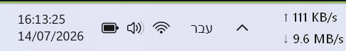

# Taskbar Network Speed

Taskbar Network Speed is a small native Windows utility that shows current network traffic directly on the taskbar. It is designed to stay light, quiet, and easy to download.

## Download

Download the latest ready-to-run package from the [Releases page](https://github.com/Banditor/taskbar-network-speed/releases/latest). Extract `TaskbarNetworkSpeed.exe` and run it. The utility can start with Windows from its right-click menu.

## Features

- Shows total current traffic as one compact line, or upload and download separately.
- Displays daily historical traffic with download, upload, and total usage.
- Stores history locally in a small `history.tsv` file; no network account or telemetry is used.
- Includes an explicit statistics reset option with confirmation.
- Right-click works across the complete taskbar display area, including the empty space around the text.
- Uses a native Win32 taskbar-attached window with no floating overlay and no separate background service.
- Includes a professional application icon and Windows file metadata.

## Screenshot

## Build

Run `build.cmd` from a Visual Studio Build Tools command-capable environment. The build embeds `TaskbarNetworkSpeed.ico` into the executable.

## עברית

Taskbar Network Speed הוא כלי Win32 קטן שמציג את תעבורת הרשת הנוכחית ישירות בשורת המשימות.

- אפשר להציג מהירות כוללת בשורה אחת או העלאה והורדה בנפרד.
- חלון סטטיסטיקה מציג שימוש יומי: הורדה, העלאה וסה״כ.
- ההיסטוריה נשמרת מקומית בקובץ `history.tsv` קטן, ללא חשבון וללא טלמטריה.
- קיים איפוס סטטיסטיקה מפורש עם בקשת אישור.
- קליק ימני פועל בכל שטח התצוגה, גם בשטח הריק סביב הטקסט.
- אין חלון צף ואין שירות רקע נפרד.

להורדה, יש להיכנס ל־[Releases](https://github.com/Banditor/taskbar-network-speed/releases/latest), להוריד את הגרסה האחרונה ולהפעיל את `TaskbarNetworkSpeed.exe`.

## Attribution and license

The taskbar attachment, layered-window approach, and daily traffic aggregation were adapted from the Win32 approach used by TrafficMonitor. The original Anti-996 license and required attribution are included in `LICENSE`.
